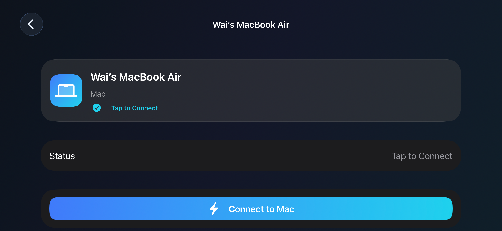

# Mac Remote

[](LICENSE)
[](https://www.swift.org)
[](#system-requirements)
[](https://mac-remote.vercel.app)

Control your Mac from your iPhone over your local network **or across the
internet**. No accounts to create, no App Store — a Mac host app and an
iPhone client app that find each other over Bonjour on your LAN, and stay
reachable from anywhere via iCloud + automatic router setup once paired.

This is a personal-use project, built from scratch on Apple's native
frameworks (SwiftUI, Network.framework, ScreenCaptureKit, VideoToolbox,
CloudKit, CryptoKit) rather than on top of WebRTC or a hosted signaling
service.

**[Open the Mac Remote website](https://mac-remote.vercel.app)** for the visual
setup guide, controls, downloads, troubleshooting, and documentation.

## Demo

<p align="center">
  
</p>

The landscape controller keeps the complete Mac display on the left, puts
running-app shortcuts at the upper right, and reserves the lower-right corner
for precise relative trackpad control.

<p align="center">
  
</p>

The connection screen discovers nearby Macs over Bonjour and offers a secure
pairing flow before remote control begins.

## Downloads

- [Download the macOS host ZIP](https://github.com/CharmTzy/MacRemote/releases/latest/download/Mac-Remote-macOS.zip)
- [Download the unsigned iPhone developer IPA](https://github.com/CharmTzy/MacRemote/releases/latest/download/Mac-Remote-iPhone.ipa)
- [Download the complete source](https://github.com/CharmTzy/MacRemote/archive/refs/heads/main.zip)

The iPhone package must be signed with your own Apple Developer team before
installation. The recommended path is still to open the project in Xcode and
run the iPhone target from there.

## Status

This repository is being built in phases (see `ARCHITECTURE.md` for the full
list). What exists right now:

- [x] Phase 1 — Project foundation, Bonjour discovery, and a Hello/HelloAck
      handshake over a real TCP connection.
- [x] Phase 2 — Pairing (numeric code), Ed25519 device identity, signature-based
      session authentication for returning devices, AES-GCM encrypted
      post-auth channel, Keychain-backed trusted-device store with revoke.
- [x] Phase 3 — Live screen streaming: ScreenCaptureKit capture → VideoToolbox
      H.264 encode → encrypted video connection → `AVSampleBufferDisplayLayer`
      on the iPhone, verified on physical Mac and iPhone hardware.
- [x] Phase 4 — Direct-touch mouse control on the video view: tap (click),
      double tap, long-press (right click), drag, two-finger scroll, all
      mapped through normalized coordinates and posted as `CGEvent`s.
- [x] Phase 5 — Keyboard: the system keyboard types real text on the Mac
      (Unicode injection, so autocorrect/emoji/any script works), a
      keyboard-accessory bar carries ⌘⌥⌃⇧ + esc/tab/arrows, and shortcuts
      like ⌘C work by arming a modifier then tapping a letter.
- [x] Phase 6 — Product UX: Trackpad mode (relative movement, alongside
      Direct Touch), a compact translucent remote toolbar, a live
      multi-display picker (switching doesn't reconnect), and real Settings
      on both apps (Quality actually changes the encoder's bitrate/frame
      rate; paired-device management; trackpad sensitivity/natural
      scrolling). No onboarding carousel — the pairing and permissions
      flows already guide a first run, and the spec's own guidance is to
      keep onboarding short.
- [x] Phase 7 — Clipboard sync (Mac→iPhone automatic; iPhone→Mac is a
      one-tap "Send Clipboard to Mac" — see SECURITY.md for why they're not
      symmetric), file transfer (iPhone→Mac, its own dedicated connection
      per transfer, progress shown on both apps), 15 system/media commands
      (Mission Control, Spotlight, sleep, volume, play/pause, ...,
      restart/shutdown behind a confirmation), and automatic reconnection
      with exponential backoff when the control connection drops
      unexpectedly.
- [x] Phase 8 — Automatic quality adjustment (`AdaptiveQualityController`,
      driven by round-trip time measured over the video connection's own
      heartbeat, unit tested), continuous-input throttling (mouse
      move/drag capped to ~60/sec so a fast drag doesn't flood the
      network), a code-review performance pass (see ARCHITECTURE.md's
      "Performance notes" — real profiling needs a device this
      environment doesn't have), and unit test coverage across every wire
      message, the crypto primitives, coordinate mapping, and the
      reconnect backoff schedule.
- [x] iPhone control refinements — full-display Fit rendering without crop,
      accurate direct-touch and relative trackpad control, a live launcher for
      running Mac apps in Fit mode's unused margins, and Wake-on-LAN for a
      remembered Mac that is sleeping on the local network.
- [x] Anywhere access — after pairing once with the 6-digit code, the
      iPhone can reach the Mac from any network (cellular, another Wi-Fi):
      the Mac publishes its addresses to your iCloud private database and
      opens a path through the home router automatically (PCP / NAT-PMP /
      UPnP, plus direct IPv6). The Mac also stays connectable while its own
      display is asleep — only quitting the app or powering off takes it
      away.

**Every feature in the spec's success criteria is implemented**: discovery,
pairing, permissions, live screen mirroring, direct-touch and trackpad
control, keyboard input and shortcuts, multi-display switching, clipboard
sync, file transfer, system commands, automatic reconnection, and adaptive
quality. All 8 phases are code-complete.

The Mac and iPhone targets have been built with Xcode and exercised on real
hardware. The shared protocol, crypto, input geometry, reconnect policy, and
compatibility code are covered by the macOS unit-test target.

## Project structure

```
MacRemote/
├── project.yml          XcodeGen project definition (see SETUP.md)
├── Shared/               Code compiled into both apps
│   ├── Models/           Connection state, device/display/quality/transfer models
│   ├── Networking/       NWConnection wrapper, Bonjour constants
│   ├── Protocol/         Binary wire format and every message type
│   ├── Security/         Keychain, identity keys, pairing crypto, SecureSession
│   └── Utilities/        Logging, device identity, geometry/backoff/quality math
├── MacHost/              macOS app (the Mac being controlled)
│   ├── App/               App entry point, Info.plist
│   ├── Views/              SwiftUI screens (Overview/Devices/Display/Permissions/Settings)
│   ├── ViewModels/         Presentation logic
│   ├── Networking/         Listener, session handling, video streaming
│   ├── ScreenCapture/      ScreenCaptureKit capture session
│   ├── VideoEncoding/      VTCompressionSession H.264 encoder
│   ├── InputControl/       CGEvent posting (mouse/keyboard/system commands)
│   ├── Pairing/            Pairing-code coordinator and UI
│   ├── Clipboard/          NSPasteboard polling
│   ├── FileTransfer/       Incoming file receiver
│   ├── Permissions/        Screen Recording / Accessibility checks
│   └── Settings/           UserDefaults-backed preference keys
└── iPhoneRemote/         iOS app (the remote control)
    ├── App/                App entry point, Info.plist
    ├── Views/              SwiftUI screens (Macs list, detail, remote viewer, ...)
    ├── ViewModels/         Presentation logic
    ├── Video/              VTDecompressionSession-free H.264 decode + display
    ├── Gestures/           UIKit gesture bridges (direct touch, trackpad)
    ├── Keyboard/           System-keyboard-to-wire-message translation
    ├── Networking/         Client connection + handshake
    ├── Discovery/          Bonjour browsing
    ├── Pairing/             Pairing-code entry UI
    ├── FileTransfer/        Outgoing file sender
    └── Settings/            Settings screen + shared preference keys
```

## System requirements

- A Mac running macOS 14 (Sonoma) or later, with Xcode 15 or later
- An iPhone running iOS 17 or later
- Both devices on the same Wi-Fi network for the **first** pairing (or a Mac
  personal hotspot); after that, see "Over the internet" below
- Both devices signed into the same Apple ID for cross-network discovery —
  the Mac publishes its addresses to your own private iCloud database, which
  only your devices can read
- A free Apple ID is enough — no paid Apple Developer Program membership
  is required for any of this. See `SETUP.md`.

## Over the internet

Once an iPhone has paired with the Mac, it remembers how to reach it from
anywhere:

1. **iCloud rendezvous.** The host app continuously publishes its current
   addresses (LAN IP, global IPv6 addresses, public IPv4 + router-mapped
   port) to your iCloud private database under the Mac's device ID. The
   iPhone reads that record when Bonjour can't see the Mac.
2. **Automatic router setup.** The Mac asks the router to forward its
   control port using PCP, then NAT-PMP, then UPnP IGD — whichever the
   router speaks — and renews the mapping automatically.
3. **Direct IPv6.** When both networks have IPv6 (cellular always does), the
   iPhone dials the Mac's IPv6 address directly with no port mapping at all.

Connecting tries each path in order — nearby → IPv6 → internet — and shows
what it's doing. If iCloud is unavailable, the iPhone falls back to the
endpoints the Mac reported during past sessions; if those are stale too,
"Connect by IP Address" always works as a manual last resort.

**Limits no app can bypass:** if your ISP puts you behind carrier-grade NAT
and neither network has IPv6, inbound connections can't get through — check
the Anywhere Access card on the Mac's Overview screen, which reports this.
And the Mac must be running: powered off means unreachable.

## Screen off ≠ unavailable

The host app holds a power assertion while it runs, so closing the lid or
letting the display sleep doesn't suspend it — the iPhone can still connect
and control the Mac blind (trackpad + keyboard work fine without seeing the
screen). Video pauses with a notice and resumes automatically when the
display wakes. Two hardware realities remain: a MacBook on battery *will*
sleep when its lid closes (keep it plugged in for lid-closed availability),
and a shut-down Mac is unreachable by definition.

## Running it

Full walkthrough (including Xcode Personal Team signing) is in
[`SETUP.md`](SETUP.md). Short version:

```bash
brew install xcodegen
xcodegen generate
open MacRemote.xcodeproj
```

Then in Xcode: select your Personal Team for both targets, run
`MacRemoteHost` on your Mac, run `iPhoneRemote` on your iPhone, open Mac
Remote on the iPhone, and your Mac should appear under **My Macs**.

The checked-in bundle identifiers are intentionally generic. Before running
on physical hardware, replace the `com.example.MacRemote.*` values in
`project.yml` with identifiers unique to your Apple Developer account.

## Permissions

The Mac app needs **Screen Recording** to stream its screen and
**Accessibility** to accept mouse/keyboard control — both required for the
app to be useful, neither silently skipped. It has a dedicated Permissions
screen that shows real status and links straight to the right System
Settings pane. If Screen Recording isn't granted when an iPhone tries to
view the screen, the Mac reports that back explicitly (a `videoError`
message) instead of the iPhone just seeing a black screen with no
explanation; if Accessibility isn't granted, input events silently don't
land (that's how `CGEvent.post` itself behaves) — the Permissions tab is
where that becomes visible.

Sleep/Restart/Shut Down/Mute/Volume (the system-command Shortcuts) need a
third, separate permission — **Automation** — the first time one of them
is used; see SECURITY.md for why that one doesn't have a dedicated status
row the way the other two do.

## Remote wake

After the iPhone has seen the updated Mac host once while it is awake, it
remembers the Mac's local wake address. If the Mac later appears offline,
the detail screen offers **Wake Mac** and sends a Wake-on-LAN packet.

For a MacBook, remote wake is intended for **Sleep**, with the Mac connected
to power and **System Settings → Battery → Options → Wake for network access**
enabled. It cannot turn on a fully shut-down MacBook because its network
hardware is no longer listening. It also cannot wake the Mac from a different
Wi-Fi network or cellular connection without extra router or VPN setup.

## Pairing and security

The first time an iPhone connects to a Mac, the Mac needs "Pair New Device"
open (Devices tab) showing a 6-digit code, which you enter on the iPhone.
After that, reconnecting doesn't need the code again — each device proved
its identity once during pairing and gets recognized automatically from
then on. See `SECURITY.md` for exactly what's protected and what the threat
model does and doesn't cover — this is a tool for personal devices, not
a hardened multi-tenant product, and the docs say so plainly rather than
overclaim.

## Troubleshooting

**My iPhone doesn't see my Mac.** Confirm both devices are on the same
Wi-Fi network for the first pairing (not one on Wi-Fi and one on
cellular/VPN). Corporate or guest Wi-Fi networks often block the multicast
traffic Bonjour needs (client isolation) — a home network or personal
hotspot is the reliable path during development. You can always fall back to
**Add by IP Address** using the address shown on the Mac's Overview screen.

**My Mac shows "LAN only" under Anywhere Access.** The router declined a
port mapping — enable UPnP in its settings (often listed as UPnP/NAT-PMP
under LAN or Advanced), or add a manual port-forward rule for TCP 53511 to
the Mac. If your provider uses carrier-grade NAT, the card says so; IPv6 may
still work automatically.

**Connecting from cellular fails.** Check, in order: the Mac app is open;
the Mac's Overview card says "Ready"; both devices are signed into the same
Apple ID with iCloud available; and your router allows UPnP.

**Xcode says my bundle identifier is already in use.** Free Personal Team
accounts need a globally unique bundle ID. Change `com.example.MacRemote.host` /
`com.example.MacRemote.mobile` in `project.yml` to something under your own name
(e.g. `com.yourname.macremote.host`), update the iCloud container in
`ServiceConstants` / both entitlements files to match, then re-run
`xcodegen generate`.

**The app on my iPhone stops working after a week.** Free Personal Team
provisioning profiles expire after 7 days. Re-run the app from Xcode with
your iPhone connected to renew it — this is an Apple limitation of free
accounts, not a bug here.

## Contributing

Issues and pull requests are welcome. Please read [CONTRIBUTING.md](CONTRIBUTING.md)
before proposing a change, and keep security-sensitive reports out of public
issues as described in [SECURITY.md](SECURITY.md).

## License

Mac Remote is available under the [MIT License](LICENSE).

## Documentation

- [`ARCHITECTURE.md`](ARCHITECTURE.md) — system design, concurrency model, phase plan
- [`PROTOCOL.md`](PROTOCOL.md) — wire format and message catalog
- [`SECURITY.md`](SECURITY.md) — threat model, pairing design, what's protected
- [`SETUP.md`](SETUP.md) — step-by-step Xcode/Personal Team setup
