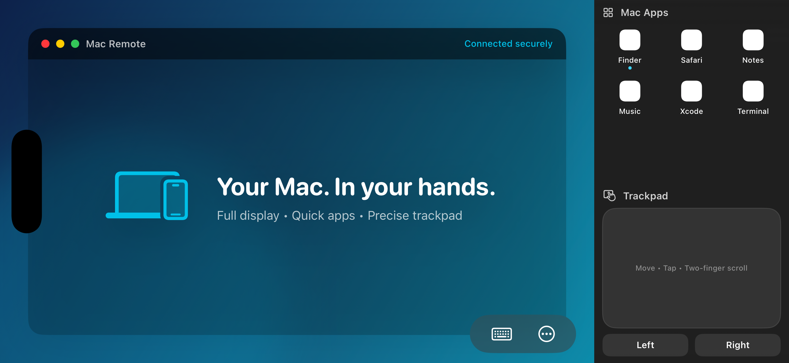

# Mac Remote

[](LICENSE)
[](https://www.swift.org)
[](#requirements)
[](https://mac-remote.vercel.app)

**Your Mac. In your hands.** See the whole display, move the pointer, type, launch apps, and send files — from your iPhone on the same Wi-Fi, or from anywhere over the internet, even on mobile data. Open source, no account, no App Store.


The landscape controller keeps the complete Mac display on the left, running-app shortcuts at the upper right, and a precise relative trackpad in the lower-right corner.

## Features

| Feature | What it does |
|---|---|
| **Full display, zero crop** | Fit mode preserves every pixel of the Mac screen. Switch displays without reconnecting. |
| **Direct touch + trackpad** | Tap exactly where you mean, or use a relative trackpad with click, right-click, drag, and scroll. |
| **Keyboard and shortcuts** | Type with the iPhone keyboard and send ⌘⌥⌃⇧, arrows, media keys, Spotlight, and Mission Control. |
| **Quick app launcher** | Running Mac apps sit beside the display — one tap brings any of them to the front. |
| **Wake, copy, and send** | Wake a sleeping Mac over LAN, sync clipboard text, and send files to the Mac. |
| **Control it from anywhere** | Pair once, add Tailscale on both devices, and the Mac stays reachable from cellular or any Wi-Fi. |
| **Works with the screen off** | The Mac stays connectable while its display sleeps. Video resumes on wake. |

Built natively with SwiftUI, Network.framework, ScreenCaptureKit, VideoToolbox, and CryptoKit — not WebRTC, and not a hosted signaling service. Screen and input traffic go directly between your iPhone and Mac.

The connection screen discovers nearby Macs over Bonjour and remembers them for one-tap reconnection.

## Download

- [macOS host app (ZIP)](https://github.com/CharmTzy/MacRemote/releases/latest/download/Mac-Remote-macOS.zip) — macOS 14+
- [iPhone developer package (IPA)](https://github.com/CharmTzy/MacRemote/releases/latest/download/Mac-Remote-iPhone.ipa) — iOS 17+, **must be signed with your own team**
- [Complete source (ZIP)](https://github.com/CharmTzy/MacRemote/archive/refs/heads/main.zip) — MIT licensed

The IPA is an unsigned developer package. The smoothest path is to build from source and run the iPhone target from Xcode, which the setup below walks through.

## Requirements

- A Mac running **macOS 14 (Sonoma)** or later, with **Xcode 15** or later
- An iPhone running **iOS 17** or later
- Both devices on the **same Wi-Fi network for the first pairing** (a Mac personal hotspot also works)
- A **free Apple ID** — no paid Apple Developer Program membership is needed
- Optional, for control from anywhere: the free **Tailscale** app on both devices

## Setup

### 1. Install XcodeGen and generate the project

The `.xcodeproj` isn't checked in — it's generated from `project.yml` so the project structure stays a readable, diffable text file. From the repository root:

```bash
brew install xcodegen
```

```bash
xcodegen generate
```

This creates `MacRemote.xcodeproj` with three targets: `MacRemoteHost` (the Mac app), `iPhoneRemote` (the iOS app), and `MacRemoteSharedTests`. Re-run `xcodegen generate` any time `project.yml` changes.

### 2. Set unique bundle identifiers

Apple requires globally unique bundle identifiers, even for apps you never submit. `project.yml` ships with placeholders that must be replaced before installing on hardware. Open `project.yml` and change both:

```yaml
PRODUCT_BUNDLE_IDENTIFIER: com.yourname.macremote.host    # MacRemoteHost target
PRODUCT_BUNDLE_IDENTIFIER: com.yourname.macremote.mobile  # iPhoneRemote target
```

The two apps share one iCloud container (`iCloud.com.example.MacRemote`, set in `Shared/Networking/ServiceConstants.swift` and both entitlements blocks in `project.yml`). If you rename the bundle IDs, change the container to match on **both** apps — e.g. `iCloud.com.yourname.macremote` — then regenerate:

```bash
xcodegen generate
```

### 3. Open the project

```bash
open MacRemote.xcodeproj
```

### 4. Select your Personal Team

For **both** the `MacRemoteHost` and `iPhoneRemote` targets:

1. Select the target in Xcode's project navigator
2. Open **Signing & Capabilities**
3. Under **Team**, choose your name (shown as "Personal Team")
4. Leave **Automatically manage signing** checked — no manual profile management needed

Don't see your name? Sign in first: **Xcode → Settings → Accounts → + → Apple ID**.

### 5. Run the Mac host

Select the `MacRemoteHost` scheme, choose **My Mac** as the destination, and press **Run**. The app opens on an **Overview** screen showing the Mac's name, network address, permission status, and an **Anywhere Access** card.

### 6. Run the iPhone app

Connect your iPhone, select the `iPhoneRemote` scheme, choose your iPhone as the destination, and press **Run**.

The first time you run a Personal Team build on a device, iOS refuses to launch it until you trust the certificate: **Settings → General → VPN & Device Management → \[Your Apple ID\] → Trust**.

> **Free-account limitation:** Personal Team builds stop running after **7 days**. Re-run from Xcode to renew. This is an Apple restriction on free accounts, not a bug in this project.

### 7. Grant the Mac's permissions

The Mac app needs two permissions, both required for it to be useful:

- **Screen Recording** — to stream the display
- **Accessibility** — to accept mouse and keyboard input

The app's **Permissions** tab shows live status for each and opens the exact System Settings pane. If Screen Recording is missing, the Mac reports it back explicitly instead of leaving the iPhone on a black screen; if Accessibility is missing, input events silently don't land, and the Permissions tab is where that becomes visible.

A third permission, **Automation**, is requested by macOS the first time you use a system Shortcut (Sleep, Restart, Volume, …). It has no status row because Apple provides no way to check it in advance — see [`SECURITY.md`](SECURITY.md).

### 8. Pair and connect

With both apps running on the same Wi-Fi:

1. On the Mac, open the **Devices** tab and choose **Pair New Device** — a **6-digit code** appears
2. On the iPhone, open Mac Remote; your Mac appears under **My Macs** within a couple of seconds
3. Tap the Mac, tap **Connect**, and enter the 6-digit code
4. Tap **Start Remote Control**

Pairing happens once. Each device proves its identity with an Ed25519 key during pairing and is recognized automatically from then on — no code on later connections. If the Mac doesn't appear, use **Add by IP Address** with the address from the Mac's Overview screen.

### 9. Control it from anywhere (optional)

The recommended path for mobile data or another Wi-Fi is the free **Tailscale** app — a private encrypted network between your devices, with no router configuration:

1. Install Tailscale on the **iPhone** (App Store) and on the **Mac** (Mac App Store)
2. Sign in to the **same account** on both — share your real email rather than using "Hide My Email", so both devices land in one network
3. Keep the Tailscale VPN toggle **on** on both devices
4. Connect once more over Wi-Fi with Tailscale running, so the iPhone learns the Mac's private address

Your Mac then shows a **VIA INTERNET** badge and connects from anywhere. Connecting tries each path in order — nearby → private network → IPv6 → internet — and shows what it's doing.

Without Tailscale, cross-network control still works if your router cooperates: the Mac requests a port mapping via PCP, NAT-PMP, or UPnP and renews it automatically, and direct IPv6 is tried too. Enable UPnP on the router (usually under LAN or Advanced), or add a manual port-forward for TCP `53511`. The Mac's **Anywhere Access** card reports which case applies.

### 10. Screen-off and remote wake (optional)

The host app holds a power assertion, so the Mac stays connectable while its display sleeps — trackpad and keyboard keep working blind, and video resumes when the display wakes. Two hardware limits remain: a MacBook that closes its lid **on battery** will sleep (keep it plugged in), and a shut-down Mac is unreachable.

For **Wake Mac** on a sleeping MacBook: connect the charger and enable **System Settings → Battery → Options → Wake for network access**. Open both apps together once while the Mac is awake so the iPhone remembers its wake address. Wake-on-LAN can't power on a fully shut-down Mac, and only works while the iPhone can reach the Mac's local network.

## Controls

| Gesture | Result | Fingers |
|---|---|---|
| Tap | Left-click at the touched point (Direct Touch) or at the pointer (Trackpad) | 1 finger |
| Double-tap | Double-click files, folders, title bars, and controls | 2 taps |
| Long-press | Right-click — opens the Mac context menu | Hold |
| Drag | Move windows, select text, drag files | Move |
| Two-finger swipe | Scroll pages and documents (natural scrolling is configurable) | 2 fingers |
| App icon | Bring any running Mac app to the front | Tap icon |

## Troubleshooting

**My iPhone doesn't see my Mac.** Keep both devices on the same Wi-Fi for the first pairing — not one on Wi-Fi and one on cellular or VPN. Corporate and guest networks often block the multicast traffic Bonjour needs (client isolation); a home network or personal hotspot is reliable. **Add by IP Address** always works as a fallback.

**The Mac shows "LAN only" under Anywhere Access.** The router declined a port mapping. Enable UPnP in its settings, or add a manual port-forward for TCP `53511` to the Mac. If your provider uses carrier-grade NAT, the card says so — IPv6 may still work automatically.

**Connecting from cellular fails.** Check in order: the Mac app is open; its Overview card says "Ready"; Tailscale is connected on **both** devices under the same account; and, without Tailscale, the router allows UPnP or has a port-forward for TCP `53511`.

**Xcode says my bundle identifier is already in use.** Free Personal Team accounts need globally unique IDs. Change the `com.example.MacRemote.*` values in `project.yml` to something under your own name, update the iCloud container in `ServiceConstants` and both entitlements to match, then re-run `xcodegen generate`.

**The app on my iPhone stops working after a week.** Personal Team provisioning profiles expire after 7 days. Re-run from Xcode with the iPhone connected to renew.

**Why is there black space beside the Mac screen?** The Mac and iPhone have different aspect ratios. Fit mode keeps the complete display visible and uses the spare area for app shortcuts and the trackpad instead of cropping.

## Documentation

- [`SETUP.md`](SETUP.md) — the full setup reference, including edge cases
- [`ARCHITECTURE.md`](ARCHITECTURE.md) — system design, concurrency model, phase plan
- [`PROTOCOL.md`](PROTOCOL.md) — wire format and message catalog
- [`SECURITY.md`](SECURITY.md) — threat model, pairing design, what's protected
- [`CONTRIBUTING.md`](CONTRIBUTING.md) — how to propose a change

Or read it all on the **[Mac Remote website](https://mac-remote.vercel.app)**.

## License

Mac Remote is available under the [MIT License](LICENSE).
